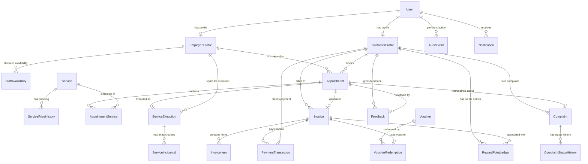
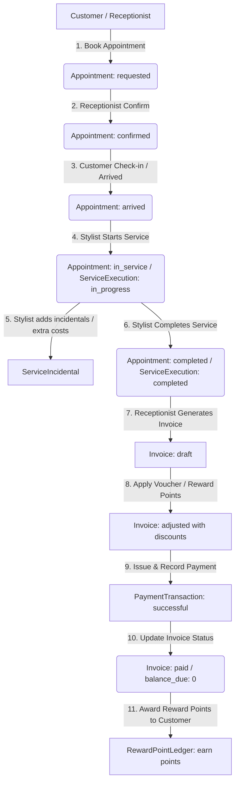

# Tài Liệu Hệ Thống Quản Lý Salon Tóc (Salon Management System)

Dự án **Hệ Thống Quản Lý Salon Tóc** là một ứng dụng web cao cấp, toàn diện được xây dựng nhằm tối ưu hóa toàn bộ quy trình vận hành của một salon tóc hiện đại. Hệ thống cung cấp giao diện riêng biệt và quy trình nghiệp vụ tối ưu cho 4 vai trò tác nhân chính: **Khách hàng (Customer)**, **Nhân viên kỹ thuật/Thợ làm tóc (Staff/Stylist)**, **Lễ tân (Receptionist)**, và **Quản lý (Manager)**.

---

## 🛠️ 1. Công Nghệ Sử Dụng (Technology Stack)

Hệ thống được thiết kế theo kiến trúc tách biệt hoàn toàn giữa Backend (API) và Frontend (Single Page Application):

### Backend Architecture
*   **Framework chính:** Django 5.x & Django REST Framework (DRF) 3.15
*   **Xác thực bảo mật:** JSON Web Token (JWT) thông qua thư viện `djangorestframework-simplejwt`.
*   **Quản lý bộ lọc:** `django-filter` phục vụ tìm kiếm nâng cao và lọc dữ liệu động ở phía máy chủ.
*   **Cơ sở dữ liệu:** SQLite (sử dụng tệp tin `db.sqlite3` cục bộ) cho môi trường phát triển nhanh.
*   **Bảo mật CORS:** `django-cors-headers` cho phép Frontend kết nối API không bị chặn.
*   **Kiểm thử tự động:** `pytest` kết hợp `pytest-django`.

### Frontend Architecture
*   **Thư viện lõi:** React 18 & TypeScript
*   **Trình đóng gói và môi trường chạy thử:** Vite 5.x
*   **Hệ thống thiết kế & Thư viện giao diện:** Ant Design (antd) v5.x & `@ant-design/icons`
*   **Định tuyến ứng dụng:** React Router DOM v6
*   **Giao tiếp API:** Axios (sử dụng Axios Interceptors để đính kèm Token và xử lý lỗi 401 tự động).
*   **Quản lý trạng thái Server:** React Query (TanStack Query) v5 giúp lưu bộ nhớ đệm (caching), đồng bộ dữ liệu tự động.
*   **Xử lý ngày tháng:** Day.js
*   **Biểu đồ báo cáo:** Recharts v2.x

---

## 📂 2. Cấu Trúc Thư Mục Dự Án (Project Structure)

Dự án được phân chia thành hai thư mục chính: `/backend` chứa mã nguồn máy chủ và `/fonend` chứa mã nguồn giao diện người dùng.

### 2.1. Cấu Trúc Backend (`/backend`)
```text
backend/
├── apps/                        # Chứa các ứng dụng nghiệp vụ Django (Apps)
│   ├── accounts/                # Tài khoản, phân quyền (Roles, Permissions, Scopes)
│   ├── appointments/            # Lập lịch hẹn, điều phối lịch hẹn
│   ├── billing/                 # Tạo hóa đơn từ lịch hẹn, tính tổng tiền, chiết khấu
│   ├── core/                    # Lớp trừu tượng nền tảng (Audit Log, Base Models, Exceptions)
│   │   ├── management/
│   │   │   └── commands/
│   │   │       └── seed_demo_data.py  # Script nạp dữ liệu chạy thử mẫu
│   │   ├── audit.py             # Logic ghi nhận nhật ký thao tác người dùng
│   │   ├── exceptions.py        # Định nghĩa các mã lỗi hệ thống (BusinessError)
│   │   ├── models.py            # Lớp cơ sở SoftDeleteModel, TimeStampedModel, AuditEvent
│   │   └── responses.py         # Chuẩn hóa phản hồi API (Success Envelope / Error Details)
│   ├── customers/               # Hồ sơ thông tin khách hàng
│   ├── employees/               # Hồ sơ nhân viên, đăng ký lịch biểu rảnh/bận
│   ├── feedback/                # Ý kiến phản hồi & quy trình giải quyết khiếu nại khách hàng
│   ├── notifications/           # Quản lý & phát thông báo cho người dùng
│   ├── payments/                # Giao dịch thanh toán (Cash, Card, Bank Transfer)
│   ├── promotions/              # Chương trình ưu đãi, Voucher và ví điểm thưởng (Rewards Point)
│   ├── reports/                 # Báo cáo thống kê doanh thu, hiệu suất hoạt động
│   └── services/                # Quản lý danh mục dịch vụ, lịch sử thay đổi giá dịch vụ
├── salon_backend/               # Cấu hình dự án Django chính
│   ├── settings.py              # Cấu hình máy chủ, cài đặt phân quyền JWT, CORS
│   ├── urls.py                  # Định tuyến chính của API
│   └── wsgi.py                  # Cổng giao tiếp máy chủ web
├── requirements.txt             # Danh sách thư viện Python
├── pytest.ini                   # Cấu hình kiểm thử tự động
└── manage.py                    # Công cụ dòng lệnh quản trị Django
```

### 2.2. Cấu Trúc Frontend (`/fonend/frontend`)
```text
frontend/
├── public/                      # Thư mục chứa tài nguyên tĩnh công cộng
├── src/
│   ├── api/                     # Định nghĩa các cuộc gọi API bằng Axios Client
│   │   ├── axiosClient.ts       # Cấu hình cơ sở Axios, đính kèm JWT và tự động điều hướng khi 401
│   │   └── [feature].api.ts     # Các API tương ứng với từng phân hệ
│   ├── app/
│   │   └── router.tsx           # Bộ định tuyến React Router với RoleGuard bảo vệ
│   ├── components/              # Các thành phần tái sử dụng (Shared Components)
│   │   ├── common/              # Thành phần chung (RoleGuard, Header, Sidebar)
│   │   └── [feature]/           # Các thành phần giao diện phục vụ tính năng chuyên biệt
│   ├── constants/               # Khai báo hằng số hệ thống (Routes, Roles, Statuses)
│   ├── hooks/                   # Các React Hooks tự định nghĩa (Custom Hooks)
│   ├── layouts/                 # Bố cục giao diện đặc trưng cho từng vai trò người dùng
│   │   ├── customer/            # Giao diện Khách hàng (Thanh menu ngang, tối giản, sáng sủa)
│   │   ├── manager/             # Giao diện Quản lý (Sidebar tối màu, phong cách Premium, Dashboards)
│   │   ├── receptionist/        # Giao diện Lễ tân (Sidebar sáng, tối ưu hóa thao tác điều hành nhanh)
│   │   ├── staff/               # Giao diện Nhân viên (Tối ưu hóa thiết bị di động/máy tính bảng)
│   │   └── AuthLayout.tsx       # Bố cục giao diện Đăng ký / Đăng nhập
│   ├── pages/                   # Thư mục chứa các trang nghiệp vụ chính (36 trang giao diện)
│   │   ├── auth/                # Trang Đăng nhập, Đăng ký thành viên
│   │   ├── customer/            # Cổng thông tin khách hàng (đặt lịch, xem voucher, khiếu nại)
│   │   ├── manager/             # Các trang quản trị dịch vụ, nhân viên, báo cáo, audit log
│   │   ├── receptionist/        # Quản lý lịch hẹn hôm nay, lịch tuần, hóa đơn, thanh toán
│   │   ├── staff/               # Xem lịch làm việc cá nhân, bắt đầu/hoàn thành dịch vụ cho khách
│   │   ├── public/              # Trang chủ công cộng, giới thiệu dịch vụ, tìm thợ làm tóc
│   │   └── errors/              # Trang lỗi 403 Forbidden, 404 Not Found
│   ├── services/                # Các dịch vụ xử lý logic phụ trợ (Token service, v.v...)
│   ├── store/                   # Quản lý trạng thái toàn cục (Auth state, User settings)
│   ├── types/                   # Định nghĩa các kiểu dữ liệu TypeScript (Interfaces)
│   ├── utils/                   # Hàm tiện ích dùng chung (Format tiền tệ, thời gian)
│   ├── index.css                # Tệp cấu hình CSS cốt lõi và hệ thống màu sắc (Design Tokens)
│   └── main.tsx                 # Điểm khởi đầu của ứng dụng React
├── package.json                 # Danh sách thư viện frontend và kịch bản lệnh
├── tsconfig.json                # Cấu hình biên dịch TypeScript
└── vite.config.ts               # Cấu hình công cụ đóng gói Vite
```

---

## 👥 3. Tác Nhân & Phân Quyền Hệ Thống (Actors & Authorization)

Hệ thống quản lý phân quyền chặt chẽ dựa trên vai trò người dùng (Role-Based Access Control). Dữ liệu demo mẫu đã cài đặt tài khoản sẵn để chạy kiểm thử:

### 3.1. Danh sách các vai trò (Actors)

| Vai Trò | Username mẫu | Mật Khẩu | Đặc Điểm Giao Diện & Bố Cục | Mô Tả Quyền Hạn Nghiệp Vụ |
| :--- | :--- | :--- | :--- | :--- |
| **Manager** *(Quản Lý)* | `manager` | `Password123!` | Tông màu tối quý phái (`ManagerLayout`), thanh điều hướng bên trái dạng thu gọn, tập trung vào phân tích. | Quản trị toàn quyền: Cấu hình danh mục dịch vụ & đơn giá, quản lý hồ sơ nhân viên, khách hàng; xem sâu các báo cáo doanh thu & hiệu suất; theo dõi vết thay đổi hệ thống (Audit Logs). |
| **Receptionist** *(Lễ Tân)* | `receptionist` | `Password123!` | Giao diện bảng điều khiển sáng sủa (`ReceptionistLayout`), thanh thao tác nhanh đưa lên tiêu đề giúp phục vụ tại quầy. | Điều hành vận hành hàng ngày: Check-in khách đến, tạo lịch hẹn mới tại quầy, lập hóa đơn, áp dụng mã ưu đãi, ghi nhận thanh toán tiền mặt/chuyển khoản, tiếp nhận góp ý trực tiếp. |
| **Staff/Stylist** *(Nhân Viên)* | `elena`, `marcus`, `sophie`, `chloe` | `Password123!` | Thiết kế tinh gọn (`StaffLayout`), tối ưu hóa kích thước cho thiết bị di động hoặc máy tính bảng đặt tại bàn làm việc. | Quản lý lịch làm việc được phân công, báo bận đột xuất, cập nhật trạng thái làm việc (Bắt đầu -> Hoàn thành), ghi nhận chi phí phát sinh (incidentals), theo dõi hoa hồng nhận được. |
| **Customer** *(Khách Hàng)* | `customer1`, `dat`, `anmin` | `Password123!` | Cổng thông tin khách hàng thân thiện (`CustomerLayout`), menu ngang đơn giản giúp tăng tính tương tác đặt chỗ. | Đặt lịch hẹn trực tuyến tự chọn thợ làm tóc và giờ yêu thích, theo dõi lịch sử dịch vụ, kiểm tra ví voucher cá nhân, tra cứu điểm tích lũy và gửi phản hồi/khiếu nại. |

### 3.2. Cơ chế bảo vệ định tuyến & Phân vùng dữ liệu (Guards & Scopes)
1.  **Role Guard ở Frontend (`RoleGuard.tsx`):**
    Sử dụng React Router để bọc các phân hệ. Nếu người dùng cố tình nhập URL của vai trò khác (ví dụ: khách hàng truy cập `/manager`), hệ thống sẽ chuyển hướng ngay lập tức về trang `/forbidden` (Lỗi 403).
2.  **Redirect sau đăng nhập (`DashboardRedirect.tsx`):**
    Tự động kiểm tra thuộc tính `role` của tài khoản khi đăng nhập thành công và chuyển hướng người dùng về trang giao diện chính tương ứng với quyền của họ.
3.  **Phân vùng dữ liệu ở Backend (`apps.accounts.scopes.scope_queryset`):**
    Cung cấp hàm phân quyền truy xuất dữ liệu ở mức cơ sở dữ liệu.
    *   *Quản lý & Lễ tân:* Được phép truy vấn toàn bộ bản ghi của tất cả khách hàng/nhân viên.
    *   *Khách hàng:* Chỉ truy vấn được thông tin của chính mình (lịch hẹn cá nhân, hóa đơn cá nhân, ví voucher cá nhân).
    *   *Nhân viên kỹ thuật:* Chỉ truy vấn được lịch hẹn được phân công trực tiếp cho mình hoặc lịch biểu làm việc của cá nhân.

---

## 🗄️ 4. Thiết Kế Cơ Sở Dữ Liệu (Database Schema)

Hệ thống tổ chức dữ liệu một cách chặt chẽ thông qua các thực thể kế thừa từ hai lớp mô hình trừu tượng nền tảng:
*   `TimeStampedModel`: Tự động điền ngày giờ tạo (`created_at`) và ngày giờ cập nhật cuối (`updated_at`).
*   `SoftDeleteModel`: Hỗ trợ **xóa mềm (soft delete)** bằng cách bật cờ `is_deleted=True` và ghi nhận thời điểm xóa `deleted_at`, giúp bảo vệ dữ liệu lịch sử hóa đơn/thanh toán không bị mất dấu vật lý khỏi cơ sở dữ liệu.

### 4.1. Sơ đồ Quan hệ Thực thể (Entity Relationship Diagram)



### 4.2. Các bảng dữ liệu chính

1.  **User (`accounts_user`):** Lưu trữ thông tin tài khoản đăng nhập chính. Có trường `role` phân loại nhóm tài khoản.
2.  **CustomerProfile (`customers_customerprofile`):** Thông tin cá nhân khách hàng, mã khách hàng `code` (tự động phát sinh dạng `CUSxxxxx`), hạng thành viên, tùy chọn ưu tiên.
3.  **EmployeeProfile (`employees_employeeprofile`):** Thông tin nhân sự của tiệm. Có mã nhân viên `employee_code` (dạng `EMPxxxxx`), loại vai trò nhân sự `role_type` và kỹ năng chuyên môn (`specialties`).
4.  **StaffAvailability (`employees_staffavailability`):** Quản lý trạng thái rảnh/bận của nhân viên theo ngày giờ cụ thể nhằm tránh xung đột khi khách đặt lịch.
5.  **Service (`services_service`):** Danh mục dịch vụ làm đẹp tại Salon (Tên, Mô tả, Đơn giá gốc `base_price`, Thời lượng thực hiện tính bằng phút `duration_minutes`).
6.  **ServicePriceHistory (`services_servicepricehistory`):** Nhật ký theo dõi mỗi khi Quản lý điều chỉnh giá dịch vụ hoặc thời lượng thực hiện (Lưu giá cũ, giá mới, người chỉnh sửa, thời gian và lý do thay đổi).
7.  **Appointment (`appointments_appointment`):** Lịch hẹn của khách hàng. Có trạng thái lịch hẹn (`status`), thời gian bắt đầu và kết thúc dự kiến, nhân viên thực hiện chính và nguồn tạo lịch (`source`).
8.  **AppointmentService (`appointments_appointmentservice`):** Bảng trung gian chi tiết các dịch vụ được chọn trong một lịch hẹn, khóa tĩnh giá và thời lượng tại thời điểm khách đặt lịch để phòng trường hợp salon tăng giá sau này.
9.  **ServiceExecution (`service_execution_serviceexecution`):** Tiến trình thực hiện thực tế của thợ làm tóc đối với lịch hẹn (Thời điểm bắt đầu, thời điểm hoàn tất thực tế, ghi chú kết quả).
10. **ServiceIncidental (`service_execution_serviceincidental`):** Các chi phí phát sinh thêm trong quá trình làm tóc (Ví dụ: khách mua thêm dưỡng chất phục hồi tóc hư tổn, mua thêm dầu gội mang về). Các chi phí này do Stylist nhập vào và sẽ tự động cộng thêm vào hóa đơn cuối cùng của khách hàng.
11. **Invoice (`billing_invoice`):** Hóa đơn thanh toán (Tổng tiền tạm tính `subtotal`, tiền chiết khấu voucher `discount_total`, giảm giá điểm tích lũy `reward_discount`, tổng tiền phải trả `total_due`, số tiền đã thanh toán `paid_amount` và dư nợ `balance_due`).
12. **InvoiceItem (`billing_invoiceitem`):** Chi tiết các khoản thu trong hóa đơn bao gồm cả dịch vụ đã đặt trước và các chi phí phát sinh (Incidental) do thợ ghi nhận.
13. **PaymentTransaction (`payments_paymenttransaction`):** Giao dịch thanh toán thực tế (Số tiền thanh toán, phương thức: Cash/Card/Transfer, mã đối chiếu ngân hàng `reference_code` và trạng thái giao dịch).
14. **Voucher (`promotions_voucher`):** Các mã giảm giá trong ví của khách hàng (Mã code, mức giảm giá trị tiền mặt hoặc phần trăm %, hóa đơn tối thiểu để áp dụng, thời hạn sử dụng).
15. **RewardPointLedger (`promotions_rewardpointledger`):** Nhật ký ví điểm thưởng tích lũy của khách hàng. Theo dõi chi tiết mọi thay đổi điểm số: Cộng điểm khi thanh toán thành công (`earn`), Trừ điểm khi đổi quà/giảm giá hóa đơn (`redeem`), Điều chỉnh thủ công của quản lý (`adjust`), Hoàn điểm khi hủy hóa đơn (`reverse`).

---

## 🔄 5. Các Luồng Nghiệp Vụ Chính (Key Business Flows)

### 5.1. Luồng Lập Lịch Hẹn, Phục Vụ & Thanh Toán (Đặt lịch -> Hoàn tất -> Tích điểm)

Đây là quy trình nghiệp vụ cốt lõi chạy xuyên suốt qua cả 4 vai trò người dùng trong hệ thống:



#### Chi tiết các bước thực hiện trong luồng:

1.  **Đặt lịch hẹn (Booking):**
    *   Khách hàng truy cập trang đặt lịch (`CustomerBookingPage.tsx`) chọn dịch vụ, thợ làm tóc yêu thích và thời gian thực hiện. Hoặc lễ tân tạo trực tiếp khi khách gọi điện đến (`ReceptionistCreateAppointmentPage.tsx`).
    *   Backend nhận yêu cầu, thực hiện kiểm tra xung đột lịch hẹn bằng hàm `has_conflict()`. Nếu nhân viên đó đang bận phục vụ một lịch hẹn khác trùng vào khoảng thời gian yêu cầu, hệ thống sẽ phát lỗi và ngăn chặn tạo lịch trùng lặp. Nếu không trùng, lịch hẹn được tạo với trạng thái ban đầu là `requested`.
2.  **Xác nhận và đón khách (Confirmation & Check-in):**
    *   Lễ tân xác nhận lịch hẹn hợp lệ thông qua trang danh sách của lễ tân (`ReceptionistTodayAppointmentsPage.tsx`), trạng thái đổi từ `requested` sang `confirmed`.
    *   Khi khách hàng đến tiệm, lễ tân bấm nút check-in khách, lịch chuyển trạng thái sang `arrived` (Đã đến).
3.  **Tiến hành làm tóc (Service Execution):**
    *   Nhân viên kỹ thuật (Stylist) đăng nhập phân hệ thợ, nhìn thấy khách hàng trong danh sách phục vụ của mình hôm nay.
    *   Stylist nhấn nút bắt đầu phục vụ. Hệ thống gọi hàm `start_service()`, tự động ghi nhận thời gian bắt đầu thực tế, tạo một bản ghi `ServiceExecution` ở trạng thái `in_progress` và chuyển trạng thái lịch hẹn sang `in_service`.
    *   Trong quá trình làm tóc, nếu khách hàng yêu cầu thêm các dịch vụ bổ sung hoặc mua dầu gội dưỡng tóc, stylist dùng tính năng thêm chi phí phát sinh trên giao diện. Backend gọi hàm `add_incidental()` tạo bản ghi `ServiceIncidental` gắn liền với phiên phục vụ hiện tại.
    *   Khi kết thúc quá trình làm đẹp cho khách, stylist ghi chú kết quả và nhấn hoàn tất. Bản ghi `ServiceExecution` chuyển sang trạng thái `completed`, lịch hẹn tương ứng chuyển trạng thái sang `completed`.
4.  **Tính hóa đơn & Thanh toán (Checkout & Invoice Processing):**
    *   Khách quay lại quầy thu ngân của lễ tân. Lễ tân nhấn nút lập hóa đơn cho lịch hẹn đã hoàn thành.
    *   Backend gọi hàm `create_invoice_from_appointment()`, tự động quét danh sách dịch vụ đã đặt trước đó cộng với các khoản chi phí phát sinh thêm (Incidentals) do stylist báo để tính ra tổng số tiền tạm tính (`subtotal`). Hóa đơn được tạo ở trạng thái `draft`.
    *   Lễ tân áp dụng mã giảm giá (Voucher) của khách hàng thông qua hàm `apply_voucher()`. Backend kiểm tra điều kiện voucher (thời hạn, đơn tối thiểu, chủ sở hữu). Nếu hợp lệ, hệ thống tính lại số tiền giảm và cộng vào trường `discount_total` của hóa đơn.
    *   Khách hàng có thể yêu cầu trừ điểm tích lũy thành viên để được giảm giá trực tiếp. Backend gọi hàm `redeem_points()`, trừ số điểm tương đương trong ví điểm và cập nhật giá trị giảm giá vào trường `reward_discount` của hóa đơn.
    *   Lễ tân chọn phương thức thanh toán của khách (Tiền mặt, quẹt thẻ hoặc chuyển khoản) và ghi nhận giao dịch thanh toán qua hàm `create_payment()`.
    *   Khi giao dịch thanh toán thành công, hệ thống cập nhật số tiền đã trả (`paid_amount`), nếu dư nợ (`balance_due`) bằng 0, hóa đơn chính thức đổi trạng thái sang `paid` và lịch hẹn đổi sang trạng thái `closed`.
5.  **Tích lũy điểm thưởng (Reward Point Distribution):**
    *   Ngay sau khi giao dịch thanh toán được chuyển sang trạng thái thành công (`successful`), backend tự động gọi hàm `award_after_payment()`.
    *   Hệ thống quy đổi giá trị hóa đơn đã thanh toán thành điểm thưởng tương ứng (ví dụ: thanh toán 250,000đ sẽ tích lũy 250,000 điểm hoặc tỷ lệ chuyển đổi tùy thuộc cấu hình hệ thống) và ghi nhận một dòng biến động dương vào sổ điểm thưởng `RewardPointLedger` của khách hàng.

---

### 5.2. Luồng Quản Lý Đăng Ký Giờ Làm Việc Của Stylist
*   Nhân viên chủ động đăng ký các khoảng thời gian rảnh/bận hàng tuần thông qua giao diện cá nhân (`StaffAvailabilityPage.tsx`).
*   Lịch biểu này giúp lễ tân và khách hàng tránh đặt lịch hẹn vào những khoảng thời gian stylist báo bận (ví dụ: stylist xin nghỉ phép, nghỉ trưa, đi đào tạo).
*   Khi Quản lý lập lịch tổng thể cho tiệm tại màn hình quản lý lịch biểu (`ManagerSchedulingPage.tsx`), quản lý có cái nhìn trực quan về biểu đồ phân bổ thời gian làm việc của toàn bộ thợ trong salon.

---

### 5.3. Luồng Góp Ý & Giải Quyết Khiếu Nại (Feedback & Complaints)
*   Khách hàng sau khi hoàn tất dịch vụ có thể gửi phản hồi đánh giá chất lượng (Rating & Review) hoặc tạo yêu cầu khiếu nại nếu không hài lòng (ví dụ: về thái độ phục vụ của nhân viên, chất lượng kiểu tóc, tính sai hóa đơn) thông qua phân hệ khách hàng.
*   Ý kiến phản hồi thông thường (`Feedback`) sẽ được chuyển đến Lễ tân/Quản lý để xem xét và phản hồi trực tiếp bằng lời nhắn trả lời.
*   Đối với khiếu nại (`Complaint`), hệ thống áp dụng quy trình xử lý chuyên sâu:
    *   Khi khiếu nại được gửi lên, trạng thái ban đầu là `received`.
    *   Quản lý sẽ xem xét và phân công người chịu trách nhiệm giải quyết (Ví dụ: giao cho lễ tân trưởng xử lý sự việc), trạng thái chuyển sang `assigned` rồi `in_review`.
    *   Nếu vụ việc nghiêm trọng, người xử lý có thể nâng cấp vụ việc lên cấp cao hơn, trạng thái chuyển thành `escalated`.
    *   Sau khi điều tra và thống nhất hướng bồi thường/xử lý với khách hàng, người chịu trách nhiệm ghi nhận phương án khắc phục, chuyển trạng thái sang `resolved` rồi đóng hồ sơ khiếu nại (`closed`).
    *   Mỗi bước chuyển đổi trạng thái khiếu nại đều được ghi nhận vào bảng lịch sử `ComplaintStatusHistory` kèm tên người thực hiện thay đổi và ghi chú cụ thể để đảm bảo tính minh bạch.

---

### 5.4. Luồng Nhật Ký Thay Đổi Hệ Thống (Audit Logs & Action Audit)
*   Để ngăn ngừa gian lận tài chính (ví dụ: tự ý sửa đổi đơn giá dịch vụ để trục lợi, tự ý tạo voucher giảm giá không rõ nguồn gốc, thay đổi số điểm thưởng khách hàng trái phép), hệ thống tích hợp luồng Audit Log nghiêm ngặt ở mức Backend.
*   Mỗi khi các hàm nghiệp vụ quan trọng trong các service backend (ví dụ: `create_appointment`, `apply_voucher`, `transition_payment`, `adjust_invoice`, `add_ledger`) được thực hiện, backend sẽ tự động gọi hàm `record_event()`.
*   Hàm này thu thập:
    *   `actor`: Người thực hiện (User).
    *   `actor_role`: Vai trò của họ tại thời điểm đó (Manager, Receptionist, v.v...).
    *   `action`: Thao tác cụ thể (Ví dụ: `invoice.adjust`, `payment.successful`).
    *   `entity_type` & `entity_id`: Đối tượng chịu tác động (Ví dụ: Invoice ID 15).
    *   `prior_state`: Trạng thái dữ liệu cũ (Định dạng JSON).
    *   `resulting_state`: Trạng thái dữ liệu mới sau khi lưu hành động (Định dạng JSON).
*   Nếu thao tác bị hệ thống từ chối do vi phạm quy tắc nghiệp vụ, hàm `record_rejection()` sẽ ghi lại nhật ký sự kiện bị từ chối cùng lý do cụ thể (`rejection_reason`).
*   Quản lý có thể xem toàn bộ nhật ký thay đổi này theo thời gian thực tại trang nhật ký hệ thống (`ManagerAuditLogPage.tsx`).

---

## 🧪 6. Quản Lý Lỗi Nghiệp Vụ (Exception Handling & Error Codes)

Hệ thống xây dựng bộ mã lỗi chuẩn hóa để Frontend dễ dàng nhận biết và hiển thị thông báo lỗi thân thiện cho khách hàng thay vì hiển thị lỗi thô từ cơ sở dữ liệu:

*   `PERMISSION_DENIED` (`permission_denied`): Thao tác vượt quá quyền hạn của vai trò hiện tại.
*   `APPOINTMENT_CONFLICT` (`appointment_conflict`): Lịch hẹn trùng giờ bận của thợ làm tóc.
*   `INVALID_STATUS_TRANSITION` (`invalid_status_transition`): Chuyển trạng thái lịch hẹn sai quy tắc (Ví dụ: Lịch hẹn đang ở trạng thái mới đặt `requested` không thể nhảy thẳng sang `completed` mà chưa qua các bước trung gian).
*   `INACTIVE_SERVICE` (`inactive_service`): Đặt lịch hẹn vào dịch vụ đã bị tạm ngưng hoạt động.
*   `VOUCHER_NOT_ELIGIBLE` (`voucher_not_eligible`): Áp dụng mã giảm giá không hợp lệ (hết hạn, sai đối tượng khách hàng hoặc chưa đạt hạn mức hóa đơn tối thiểu).
*   `INSUFFICIENT_REWARD_POINTS` (`insufficient_reward_points`): Số điểm tích lũy trong ví không đủ để khấu trừ thanh toán.
*   `PAYMENT_STATE_ERROR` (`payment_state_error`): Chuyển trạng thái giao dịch thanh toán sai quy tắc (Ví dụ: Giao dịch đã thanh toán thành công `successful` không thể chuyển ngược về trạng thái đang chờ xử lý `pending`).
*   `COMPLAINT_ASSIGNMENT_ERROR` (`complaint_assignment_error`): Gặp lỗi khi phân công xử lý khiếu nại.
*   `VALIDATION_ERROR` (`validation_error`): Dữ liệu nhập vào biểu mẫu không hợp lệ.

---

## 🚀 7. Hướng Dẫn Khởi Chạy Nhanh Dự Án (Getting Started)

### Bước 1: Khởi chạy API Backend (Django)
Yêu cầu hệ thống đã cài đặt sẵn Python 3.10 trở lên. Mở cửa sổ dòng lệnh PowerShell:

```powershell
# Di chuyển vào thư mục dự án
cd c:\BAITAP\slong\salon_project-main

# Kích hoạt môi trường ảo Python
.\.venv\Scripts\Activate.ps1

# Di chuyển vào thư mục backend
cd backend

# Chạy lệnh cập nhật cấu trúc bảng cơ sở dữ liệu
python manage.py migrate

# Chạy lệnh nạp dữ liệu demo mẫu (Mật khẩu đồng bộ cho các tài khoản là Password123!)
python manage.py seed_demo_data

# Khởi động máy chủ backend tại cổng 8000
python manage.py runserver
```

### Bước 2: Khởi chạy Giao Diện Frontend (React + Vite)
Yêu cầu hệ thống đã cài đặt NodeJS v18 trở lên. Mở cửa sổ dòng lệnh thứ hai:

```powershell
# Di chuyển vào thư mục chứa mã nguồn frontend
cd c:\BAITAP\slong\salon_project-main\fonend\frontend

# Cài đặt các thư viện phụ thuộc (nếu là lần đầu chạy dự án)
npm install

# Khởi động máy chủ phát triển frontend
npm run dev
```

*Sau khi cả hai máy chủ hoạt động, hãy truy cập địa chỉ `http://localhost:5173` trên trình duyệt web và sử dụng thông tin đăng nhập demo ở mục **3.1** để bắt đầu trải nghiệm toàn diện hệ thống.*
